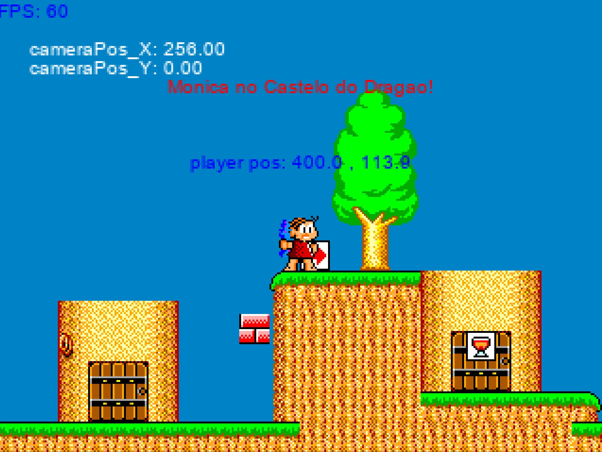
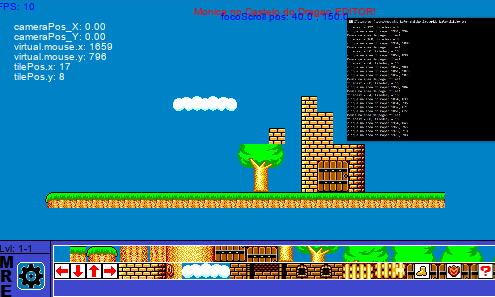

# Remake Monica No Castelo Do Dragão
Starts of a remake of this game written in C++ (not completed project)

## Apenas algumas informações gerais sobre o projeto:

- Um projeto não finalizado de um remake para o jogo Mônica no Castelo do Dragão para Master System.
- A idéia era apenas fazer um Remake com o mesmo estilo do jogo, porém com objetivo de criar novas fases e extender o jogo.
- **Não** é um projeto licenciado - feito apenas para propósito de hobby e educacional.
- O projeto foi originalmente feito para o Visual Studio Community 2017 e pode conter arquivos relacionados a esta IDE.
- Para  editar o projeto e até mesmo rodá-lo você precisasará instalar e configurar corretamente a biblioteca **Allegro 5** para C++. Não está contido arquivos da biblioteca neste repositório, se hover algo, são apenas resquíscios.

### Editor de Fases

- O editor de fases segue as mesma orientações gerais do projeto principal.
- Ele ainda estava em fase de desenvolvimento, portanto ainda depende de alguns comandos em linha de comando (cmd) para funcionar completamente.
- Apenas adiciona alguns tipos de *tiles* voltados a edição da primeira fase, como já dito ** assim como o projeto principal este NÃO é um projeto finalizado **.

### Continuidade do projeto
-Até o momento não há interesse na continuidade do projeto, mas quem sabe um dia... 

## Imagens do Projeto
### Jogo

### Editor de Fases

